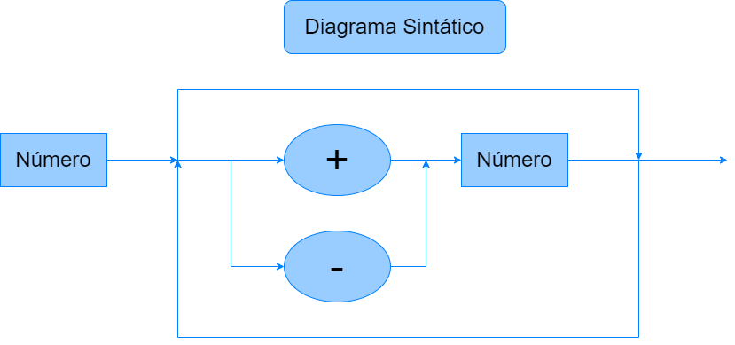

# C-Like Language Compiler and Interpreter

[](https://www.python.org/)
[](LICENSE)
[](https://github.com/pedrocivita/logCompPedroCivita)

A complete compiler and interpreter implementation for a C-like programming language, developed as part of the Logic of Computation course (7th semester) in Computer Engineering at Insper.

## Overview

This project implements a full-featured compiler pipeline including lexical analysis, syntax parsing, semantic analysis, and interpretation for a custom programming language with C-like syntax. The language supports functions, control structures, type checking, and standard I/O operations.

## Key Features

- **Complete Lexical Analysis**: Tokenizer with support for keywords, identifiers, operators, and literals
- **Syntax Parser**: Recursive descent parser implementing EBNF grammar
- **Semantic Analysis**: Type checking and symbol table management
- **AST Generation**: Abstract Syntax Tree construction and evaluation
- **Function Support**: First-class functions with parameters and return values
- **Control Structures**: If/else statements and while loops
- **Type System**: Integer and string types with type safety
- **I/O Operations**: Printf for output and scanf for input

## Architecture

### Compiler Pipeline

The compiler follows a traditional multi-stage architecture:

1. **Preprocessing** (`PrePro`): Removes comments from source code
2. **Lexical Analysis** (`Tokenizer`): Converts source code into tokens
3. **Syntax Analysis** (`Parser`): Builds Abstract Syntax Tree from tokens
4. **Semantic Analysis**: Type checking and symbol table management
5. **Interpretation**: Direct execution of the AST

### Components

#### Tokenizer
Performs lexical analysis, recognizing:
- Keywords: `int`, `str`, `void`, `if`, `else`, `while`, `return`, `printf`, `scanf`
- Operators: Arithmetic (`+`, `-`, `*`, `/`), Relational (`==`, `!=`, `<`, `>`, `<=`, `>=`), Logical (`&&`, `||`, `!`)
- Literals: Integer numbers and string literals
- Identifiers: Variable and function names

#### Parser
Implements recursive descent parsing following the EBNF grammar. Generates an AST with nodes for:
- Program structure and function declarations
- Statements: variable declarations, assignments, control flow
- Expressions: binary operations, unary operations, function calls
- Literals and identifiers

#### Symbol Table
Manages variable scope and type information:
- Hierarchical scoping with parent-child relationships
- Type checking on variable declaration and assignment
- Support for local function scopes

#### Function Table
Manages function declarations and calls:
- Function signature storage with parameter types
- Type checking on function calls
- Return value handling

---

## Language Syntax

### Syntax Diagram



---

## EBNF Grammar

### Basic Definitions

```ebnf
LETTER          = "a" | "b" | ... | "z" | "A" | "B" | ... | "Z" ;
DIGIT           = "0" | "1" | "2" | "3" | "4" | "5" | "6" | "7" | "8" | "9" ;
IDENTIFIER      = LETTER, { LETTER | DIGIT | "_" } ;
NUMBER          = DIGIT, { DIGIT } ;
STRING_LITERAL  = '"', { any character except '"' }, '"' ;
```

### Program Structure

```ebnf
PROGRAM             = { FUNCTION_DECLARATION } ;
```

### Function Declarations

```ebnf
FUNCTION_DECLARATION = TYPE, IDENTIFIER, "(", [ PARAMETER_LIST ], ")", BLOCK ;
PARAMETER_LIST       = PARAMETER, { ",", PARAMETER } ;
PARAMETER            = VARIABLE_TYPE, IDENTIFIER ;
```

### Types

```ebnf
TYPE                = "int" | "str" | "void" ;
VARIABLE_TYPE       = "int" | "str" ;
```

### Blocks and Statements

```ebnf
BLOCK               = "{", { STATEMENT }, "}" ;
STATEMENT           = VARIABLE_DECLARATION ";"
                    | ASSIGNMENT ";"
                    | PRINT ";"
                    | SCANF ";"
                    | RETURN_STATEMENT ";"
                    | IF_STATEMENT
                    | WHILE_STATEMENT
                    | FUNCTION_CALL ";"
                    | BLOCK
                    | ";" ;
```

### Variable Declarations

```ebnf
VARIABLE_DECLARATION = VARIABLE_TYPE, VARIABLE_LIST ;
VARIABLE_LIST        = VARIABLE_ENTRY, { ",", VARIABLE_ENTRY } ;
VARIABLE_ENTRY       = IDENTIFIER, [ "=", EXPRESSION ] ;
```

### Return Statements

```ebnf
RETURN_STATEMENT     = "return", EXPRESSION ;
```

### Assignments and Expressions

```ebnf
ASSIGNMENT          = IDENTIFIER, "=", EXPRESSION ;
EXPRESSION          = TERM, { ( "+" | "-" | "==" | "!=" | "<" | ">" | "<=" | ">=" | "&&" | "||" ), TERM } ;
TERM                = FACTOR, { ( "*" | "/" ), FACTOR } ;
FACTOR              = [ ( "+" | "-" | "!" ) ], (
                        NUMBER
                      | STRING_LITERAL
                      | "(", EXPRESSION, ")"
                      | IDENTIFIER
                      | FUNCTION_CALL
                      | SCANF_CALL
                      ) ;
```

### Function Calls

```ebnf
FUNCTION_CALL       = IDENTIFIER, "(", [ ARGUMENT_LIST ], ")" ;
ARGUMENT_LIST       = EXPRESSION, { ",", EXPRESSION } ;
```

### Input and Output

```ebnf
PRINT               = "printf", "(", EXPRESSION, ")" ;
SCANF               = "scanf", "(", ")" ;
SCANF_CALL          = SCANF ;
```

### Control Structures

```ebnf
IF_STATEMENT        = "if", "(", EXPRESSION, ")", STATEMENT, [ "else", STATEMENT ] ;
WHILE_STATEMENT     = "while", "(", EXPRESSION, ")", STATEMENT ;
```

### Operators and Symbols

```ebnf
OPERATOR            = "+" | "-" | "*" | "/" | "==" | "!=" | "<" | ">" | "<=" | ">=" | "&&" | "||" | "!" ;
SEPARATOR           = ";" | "," ;
BRACKET_OPEN        = "(" ;
BRACKET_CLOSE       = ")" ;
BRACE_OPEN          = "{" ;
BRACE_CLOSE         = "}" ;
```

---

## Usage

### Prerequisites

- Python 3.8 or higher

### Running a Program

```bash
python main.py <source_file>
```

Where `<source_file>` is a file containing source code in the language syntax.

### Example Program

```c
int factorial(int n) {
    if (n <= 1) {
        return 1;
    }
    return n * factorial(n - 1);
}

void main() {
    int num;
    num = scanf();
    printf(factorial(num));
}
```

### Comments

The language supports C-style multi-line comments:

```c
/* This is a comment */
```

---

## Implementation Details

### Error Handling

The compiler provides comprehensive error messages for:
- Syntax errors during parsing
- Type mismatches in operations and assignments
- Undeclared variables and functions
- Division by zero
- Missing main function

### Type System

- **Integers**: Standard integer arithmetic and comparison operations
- **Strings**: String literals with concatenation support using `+` operator
- **Type Coercion**: Boolean values can be used where integers are expected
- **Type Safety**: Strong type checking prevents incompatible operations

### Scope Management

- Global scope for function declarations
- Local scope for function parameters and local variables
- Proper scope resolution with parent-child relationships

---

## Technical Stack

- **Language**: Python 3.8+
- **Paradigm**: Object-Oriented Programming
- **Design Patterns**: Abstract Syntax Tree, Visitor Pattern, Symbol Table

---

## Project Structure

```
logCompPedroCivita/
├── main.py              # Main compiler implementation
├── img/
│   └── diagramaSintatico.png  # Syntax diagram
└── README.md            # This file
```

---

## Academic Context

This project was developed for the Logic of Computation course in the 7th semester of the Computer Engineering program at Insper - Instituto de Ensino e Pesquisa. The implementation demonstrates fundamental compiler design concepts including lexical analysis, parsing theory, semantic analysis, and runtime interpretation.

---

## Contact

**Pedro Civita**

- Email: pedroac2@al.insper.edu.br
- LinkedIn: [linkedin.com/in/pedrocivita](https://www.linkedin.com/in/pedrocivita)
- GitHub: [github.com/pedrocivita](https://github.com/pedrocivita)

---

## License

This project is part of academic coursework at Insper and is available for educational purposes.

---
